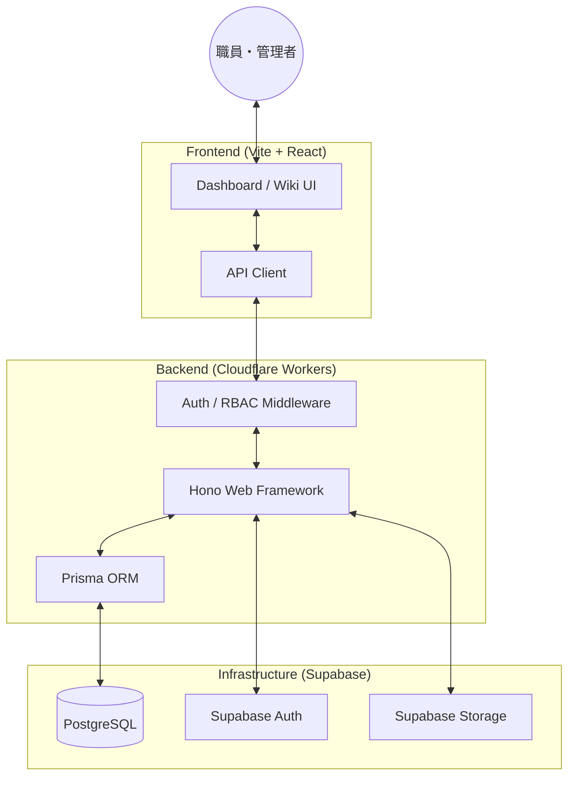
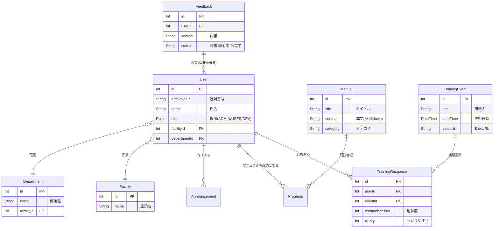

# 医療・介護向けメディカルWiki & 学習管理システム (LMS)

本システムは、医療・介護現場の「学び」と「知恵」を支え、日々の業務品質を向上させるためのデジタルプラットフォームです。

## 🌟 現場で活用する皆さまへ

忙しい医療・介護の現場において、情報共有の漏れや教育の負担は大きな課題です。本アプリは、ITに詳しくない方でも直感的に使えるデザインで、以下の3つの価値を提供します。

### 1. いつでもどこでも、隙間時間で「学べる」
- **動画研修**: スマートフォンやタブレットから、最新のケア技術や感染症対策の研修をいつでも視聴できます。
- **理解度の確認**: 視聴後に簡単なアンケートに答えるだけで、あなたの学びが記録されます。

### 2. 現場の知恵がつまった「電子マニュアル (Wiki)」
- **知恵袋**: 「あの手順どうだったっけ？」と思った時、キーワード検索ですぐに正しい手順が見つかります。
- **最新情報の共有**: 紙のマニュアルのように古くなることがなく、常に最新の内容が共有されます。

### 3. あなたの声を組織へ届ける「ご意見箱」
- **現場の声を形に**: システムの使い勝手やマニュアルへの改善提案など、気づいたことをいつでも投稿できます。

### 📄 紙運用 vs 本システム（導入のメリット）

| 比較項目 | 従来の紙・掲示板運用 | 本システム導入後 |
| :--- | :--- | :--- |
| **情報の探しやすさ** | 分厚いファイルから探す手間 | キーワード検索で一瞬 |
| **研修の受講** | 全員集合が必要（調整が大変） | 自分の好きなタイミングで受講 |
| **情報の鮮度** | 修正のたびに差替・再配布 | 1箇所の更新で全員に即時共有 |
| **現場の声** | 直接言うかメモを残す | 匿名性も保ちつつアプリから手軽に |

---

## 🛠 For Developers & Engineers

### 設計思想
本システムは、**「ナレッジ共有と教育への特化」**を最優先に設計されています。
勤務管理（有給休暇の申請やシフト管理など）は、基幹システムである電子カルテ側に集約・一元化することを前提とし、本アプリからはそれらの機能を完全に切り離しました。これにより、現場の職員が「学ぶこと」「教え合うこと」に集中できる、軽量かつ高機能なツールを目指しています。

### システム構成図
Hono をベースとしたサーバーレスアーキテクチャを採用し、スケーラビリティと高速な応答性を実現しています。



### データモデル (ER図)
Prisma スキーマに基づいた主要なデータ構造です。



## 🚀 セットアップ手順

### 1. 依存関係のインストール
```bash
npm install
```

### 2. 環境変数の設定
`.dev.vars` ファイルをルートに作成し、以下の変数を設定してください。
```toml
SUPABASE_URL="<YOUR_SUPABASE_PROJECT_URL>"
SUPABASE_ANON_KEY="<YOUR_SUPABASE_ANON_KEY>"
DATABASE_URL="<YOUR_PRISMA_ACCELERATE_OR_DIRECT_URL>"
```

### 3. データベースの同期
Prismaを使用してスキーマを反映します。
```bash
npx prisma db push
```

### 4. 開発サーバーの起動
```bash
npm run dev
```
<<<<<<< feature/rehab-support-system
これにより、バックエンド（Wrangler）とフロントエンド（Vite）が同時に起動します。
- Frontend: http://localhost:3000
- Backend: http://localhost:8787

## 技術スタック
- **Backend**: Hono (Cloudflare Workers)
- **Database**: Supabase (PostgreSQL) + Prisma
- **Storage**: Supabase Storage
- **Frontend**: React + Vite

## テストアカウント

| 職員番号 | パスワード | 名前 | 権限 | 職種 |
| :--- | :--- | :--- | :--- | :--- |
| `dev001` | `password123` | Developer User | DEVELOPER | — |
| `admin001` | `password123` | Admin User | ADMIN | — |
| `user001` | `password123` | 佐藤 健太 | USER | 理学療法士 |
| `user002` | `password123` | 鈴木 舞 | USER | 看護師 |

## 🌟 コア機能ガイド (Core Features)

### 1. 管理者ダッシュボード (Admin Dashboard)


**組織の司令塔としての価値提供**
従来の勤怠管理機能を分離し、組織の現状を俯瞰するための3タブ構成（「学習進捗」「組織統計」「現場の声」）へ進化しました。各部署の研修達成率やコンプライアンス状況をリアルタイムに可視化し、素早い意思決定を支援します。

### 2. Wiki / ナレッジ共有 (Wiki & Knowledge Sharing)


**現場の暗黙知を形式知へ**
Markdownベースのドキュメント作成とタグ付けにより、日々の業務で培われたノウハウを蓄積。すべての職員が最新の業務手順やガイドラインに瞬時にアクセスできる環境を構築し、属人化を防ぎます。

### 3. ご意見箱 / 現場の声 (Feedback & Suggestion Box)


**組織の風通しを良くする双方向コミュニケーション**
管理者ダッシュボード内の「現場の声」タブを通じて、職員からのシステム要望やマニュアル改善案を直接収集。「未確認・対応中・完了」のステータス管理により、現場の声を迅速に吸い上げ、機敏な運用改善サイクルを実現します。

## 📂 プロジェクト構成 (Directory Structure)

```text
medical-wiki-lms-serverless/
├── backend/            # Hono (Cloudflare Workers) & Prisma 構成
│   ├── prisma/         # データベーススキーマとマイグレーション
│   └── src/
│       ├── controllers/# 各種API処理エンドポイント
│       ├── core/       # エラーハンドリング・ミドルウェア
│       ├── middleware/ # 認証 (JWT) および ロールベースアクセス制御
│       └── services/   # ビジネスロジック実装
│
├── frontend/           # React + Vite 構成
│   ├── public/         # 静的アセット (ロゴ等)
│   └── src/
│       ├── api/           # バックエンド通信用APIクライアント (機能別に分割)
│       │   ├── index.ts   # 統合ハブ (後方互換のため `api` オブジェクトを再エクスポート)
│       │   ├── helpers.ts # 共通ヘルパー (API_BASE, getHeaders)
│       │   ├── auth.ts    # 認証系
│       │   ├── users.ts   # ユーザー管理系
│       │   ├── org.ts     # 組織管理系 (施設・部署・職種)
│       │   ├── manuals.ts # マニュアル・進捗系
│       │   ├── training.ts # 研修管理系
│       │   ├── admin.ts   # システム管理・セキュリティ系
│       │   ├── announcements.ts # お知らせ系
│       │   └── leaves.ts  # 有給・勤怠管理系
│       ├── hooks/         # カスタムHooks (ページロジックの抽出)
│       │   ├── useOrganization.ts      # 組織管理CRUD
│       │   ├── useUserManagement.ts    # ユーザー管理CRUD
│       │   └── useTrainingManagement.ts # 研修管理CRUD
│       ├── components/
│       │   ├── admin/     # 管理画面用UIコンポーネント
│       │   │   ├── FacilityList.tsx          # 施設・部署ツリー表示
│       │   │   ├── UserTable.tsx             # ユーザー一覧テーブル
│       │   │   ├── UserFormModal.tsx         # ユーザー追加/編集モーダル
│       │   │   ├── TrainingEventTable.tsx    # 研修テーブル
│       │   │   └── TrainingEventFormModal.tsx # 研修フォームモーダル
│       │   ├── layout/   # レイアウト部品 (PageHeader, AdminPageLayout等)
│       │   └── ui/       # 汎用UI部品 (Button, Card, Input, Badge, Modal等)
│       ├── pages/      # ページコンポーネント (Dashboard, Manuals等)
│       └── types.ts    # フロントエンド用の型定義
│
├── .dev.vars           # Cloudflare Workers用 ローカル環境変数
├── package.json        # モノレポ構成 (Frontend/Backend一括起動用)
└── README.md           # プロジェクト全体に関する説明（本ファイル）
```

## 管理機能の構成
管理者メニューは以下の2つの統合ページに再編されています。

### マスタ管理 (`/admin/master`)
組織構成や職種マスターなど、システムの基盤データをタブで切り替えて管理します。
- **組織管理タブ**: 施設の登録から紐付く部署の構成までを1画面で管理
- **職種管理タブ**: 理学療法士、作業療法士、言語聴覚士、看護師、介護職、事務職等の職種マスターを管理

### 運用管理 (`/admin/operations`)
日常運用に関する管理機能をタブで切り替えて操作します。
- **ユーザー管理タブ**: ユーザーの一覧・作成・編集・削除
- **お知らせ管理タブ**: 施設全体または特定施設向けのお知らせを管理
- **研修管理タブ**: 研修イベントの作成・回答状況の確認

初期データとして、4施設（本部病院、本部病院介護医療院、後光病院、玉診療所）と各部署、7種の職種がシードデータから提供されています。

### 管理画面UIの設計方針
管理画面は `AdminPageLayout` 共通ラッパーにより、以下の設計方針で統一されています。
- **コンパクトヘッダー**: 装飾を排したシンプルなタイトル表示で、データ操作に集中できるレイアウト
- **フラットなタブUI**: Material 3 Secondary Tabs に準じた控えめなタブデザインで画面全体の一体感を確保
- **統一されたテーブルスタイル**: 全タブで `stone-*` カラー系のテーブルヘッダー、行ホバー、角丸を共通化


リハビリ職種（理学療法士・作業療法士・言語聴覚士）のユーザーは、Myダッシュボードにリハビリ専門リソースへのショートカットが表示されます。

## 職種プレビュー機能（管理者・開発者向け）
管理者（ADMIN）および開発者（DEVELOPER）は、Myダッシュボード上部に表示される「職種プレビュー」タブを使用して、各職種のダッシュボードビューをプレビューできます。  
対応タブ: リハビリ（理学療法士・作業療法士・言語聴覚士を統合）、看護師、介護職、その他。  
一般ユーザー（USER）にはタブは表示されず、自身の職種に応じたコンテンツのみが表示されます。

## 📱 モバイル表示における表示領域の最適化 (Responsive Display)
システム全般において、モバイルデバイスで閲覧する際の「横幅不足による不自然な改行」を防ぐため、以下の表示調整を行なっています。

- **全ページ共通の見出し（ヘッダー）PC/モバイル完全統一**:
  - 各トップレベル画面（Myダッシュボード、マニュアル一覧、研修会一覧、マスタ管理、運用管理）の見出しコンポーネントを、リッチなオレンジ背景の `PageHeader`（Heroバリアント）に完全統一しました。PC表示時（`md`以上）は美しい統一感のあるヘッダーとして機能します。
  - スマホ環境（`md`未満）では、この `PageHeader` の上下の余白を極小化し、装飾のサブタイトル（説明文）を非表示（`hidden md:block`）にする「引き算のデザイン」が自動適用されます。
  - さらに、マスタ管理や運用管理内の各コンポーネント（施設管理、職種管理、ユーザー管理等）に点在していたローカル見出しも、共通のアイコン＋タイトル規格に統合しました。
  - これにより、PCではプロフェッショナルな統一感を確立しつつ、スマホでは画面を開いた瞬間にタイトルとアクションボタンがスッキリと「横1行」に収まり、素早くコンテンツへアクセスできます。

- **管理者ダッシュボード（稼働ノード管理）**: 
  - スマホ表示時専用（`md`未満）に、従来の横並びテーブル形式を撤廃し、縦積み・横広の「2段構成リスト形式」へと抜本的にレイアウトを再定義しました。
  - **左側（2段構成）**: **1行目**には氏名を省略（truncate）せずに `whitespace-nowrap` でフルネームで強調表示し、横にステータスバッジ（UP等）を並べています。**2行目**には「施設名 / 部署名」を小さく薄い文字色で配置し、直感的な情報の紐付けを実現しました。
  - **右側（アクション）**: 編集ボタンを右端に絶対配置（Absolute）として浮かせ、かつモバイルでの操作性を担保する最小44pxのタップ領域を備えたアイコン専用ボタンとして最適化しています。
  - **情報の最適化（引き算のデザイン）**: 同時に、モバイル表示時はテーブルヘッダー（`thead`）やユーザーID、修飾文字など、重要度の低い情報を非表示（`hidden`）に設定し、「誰が」「どのような状態か」「どこに所属しているか」という最重要要素だけが一目でスマートに伝わるようデザインしました。この際、PC（ブレークポイント `md` 以上）におけるゆとりあるテーブルレイアウトは1ピクセルも変更されていません。
