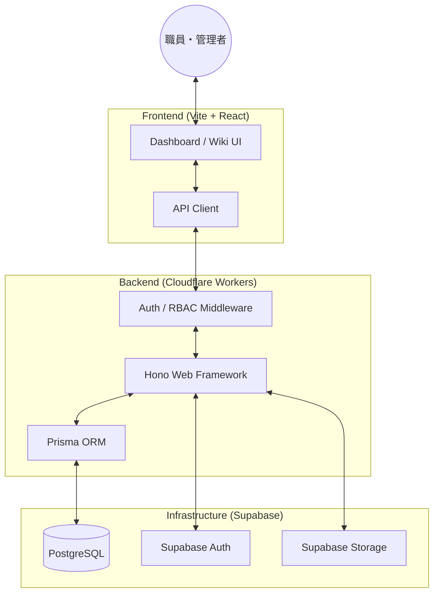
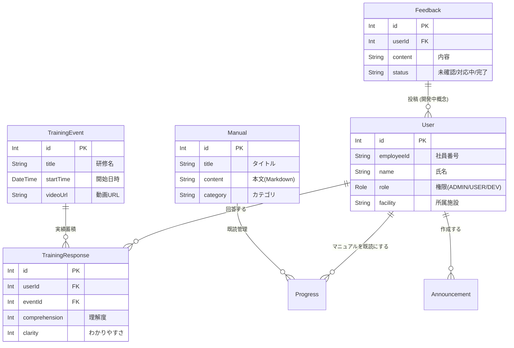

# 医療・介護向けメディカルWiki & 学習管理システム (LMS)

本システムは、医療・介護現場の「学び」と「知恵」を支え、日々の業務品質を向上させるためのデジタルプラットフォームです。

## 🌟 現場で活用する皆さまへ

忙しい医療・介護の現場において、情報共有の漏れや教育の負担は大きな課題です。本アプリは、ITに詳しくない方でも直感的に使えるデザインで、以下の3つの価値を提供します。

### 1. いつでもどこでも、隙間時間で「学べる」
- **動画研修**: スマートフォンやタブレットから、最新のケア技術や感染症対策の研修をいつでも視聴できます。
- **理解度の確認**: 視聴後に簡単なアンケートに答えるだけで、あなたの学びが記録されます。

### 2. 現場の知恵がつまった「電子マニュアル (Wiki)」
- **知恵袋**: 「あの手順どうだったっけ？」と思った時、キーワード検索ですぐに正しい手順が見つかります。
- **最新情報の共有**: 紙のマニュアルのように古くなることがなく、常に最新の内容が共有されます。

### 3. あなたの声を組織へ届ける「ご意見箱」
- **現場の声を形に**: システムの使い勝手やマニュアルへの改善提案など、気づいたことをいつでも投稿できます。

### 📄 紙運用 vs 本システム（導入のメリット）

| 比較項目 | 従来の紙・掲示板運用 | 本システム導入後 |
| :--- | :--- | :--- |
| **情報の探しやすさ** | 分厚いファイルから探す手間 | キーワード検索で一瞬 |
| **研修の受講** | 全員集合が必要（調整が大変） | 自分の好きなタイミングで受講 |
| **情報の鮮度** | 修正のたびに差替・再配布 | 1箇所の更新で全員に即時共有 |
| **現場の声** | 直接言うかメモを残す | 匿名性も保ちつつアプリから手軽に |

---

## 🛠 For Developers & Engineers

### 設計思想
本システムは、**「ナレッジ共有と教育への特化」**を最優先に設計されています。
勤務管理（有給休暇の申請やシフト管理など）は、基幹システムである電子カルテ側に集約・一元化することを前提とし、本アプリからはそれらの機能を完全に切り離しました。これにより、現場の職員が「学ぶこと」「教え合うこと」に集中できる、軽量かつ高機能なツールを目指しています。

### システム構成図
Hono をベースとしたサーバーレスアーキテクチャを採用し、スケーラビリティと高速な応答性を実現しています。



### データモデル (ER図)
Prisma スキーマに基づいた主要なデータ構造です。



## 🚀 セットアップ手順

### 1. 依存関係のインストール
```bash
npm install
```

### 2. 環境変数の設定
`.dev.vars` ファイルをルートに作成し、以下の変数を設定してください。
```toml
SUPABASE_URL="<YOUR_SUPABASE_PROJECT_URL>"
SUPABASE_ANON_KEY="<YOUR_SUPABASE_ANON_KEY>"
DATABASE_URL="<YOUR_PRISMA_ACCELERATE_OR_DIRECT_URL>"
```

### 3. データベースの同期
Prismaを使用してスキーマを反映します。
```bash
npx prisma db push
```

### 4. 開発サーバーの起動
```bash
npm run dev
```
- Frontend: `http://localhost:3000`
- Backend: `http://localhost:8787`

---

## 📂 プロジェクト構成
- `backend/`: Hono (Cloudflare Workers) による API サーバー
- `frontend/`: React + Vite による SPA
- `prisma/`: データベース定義とマイグレーション
